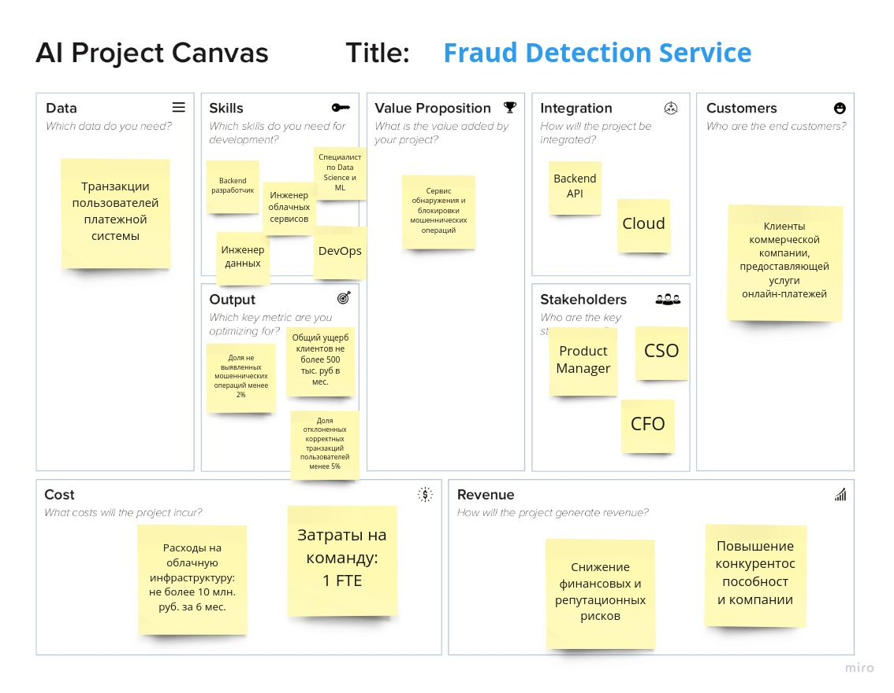

# Fraud Detection Service

Fraud Detection Service - сервис на базе машинного обучения, способный в режиме реального времени выявлять мошеннические операции при проведении онлайн-платежей. Предназначен для внедрения в существующую IT-инфраструктуру компании для отклонения подозрительных операций и отправки уведомлений администратору безопасности.

## Требования к системе

1. Доля выявленных антифрод-системой мошеннических транзакций должна быть не меньше 98%, также общий ущерб клиентов не должен превышать 500 тысяч рублей в месяц. В противном случае компания потеряет конкурентноспособность.
2. Доля корректных транзакций, которые система определяет как мошеннические, не должна превышать 5%. Иначе возможен отток клиентов.
3. Сервис должен быть легко масштабируемым на случай увеличения нагрузки на систему (перед праздниками, например).
4. Для разворачивания антифрод-системы предполагается использовать облачные сервисы, так как компания не имеет своих собственных вычислительных ресурсов.
5. Бюджет проекта не должен превышать 10 млн. руб. (без учета зарплат сотрудников).
6. Первый прототип системы, демонстрирующий возможность достижения целевых метрик, должен быть представлен заказчику в течении 3 месяцев. Весь проект должен быть завершен в течении полугода.
7. При хранении и обработке данных должна быть обеспечена их конфиденциальность.

## Canvas

